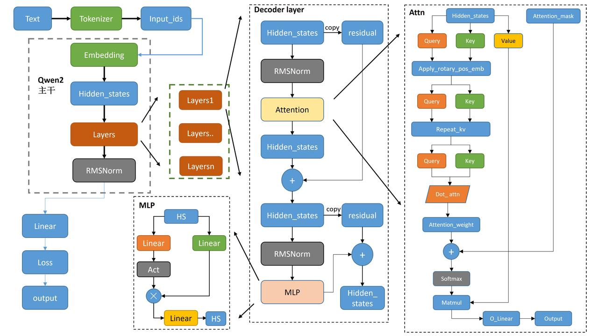
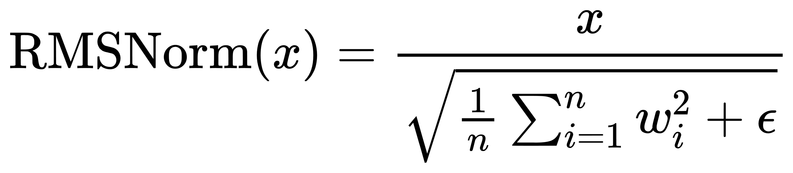
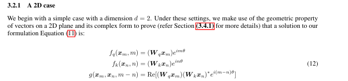

本次主要学习qwen2的主干模型

文本通过tokenizer将子词转换为词表的索引并送给Embedding层，给出向量结果hidden_states；

hidden_states经过decoderLayers：

- 每个layer将hs正则化后交给self-attention得出结果，再与hs的残差相加，得到hs_2

- hs_2经过正则化后交给MLP多层感知机得出结果，再与hs_2的残差相加

Layers经过正则化，输出给下游任务

难点：

- ROPE 

- GQA 

- MaskAttention 略

- 正则化Qwen2RMSNorm 略，即作者给出的公式

  其中:

  - $x$是层的输入的`hidden_state`
  - $w_i$ 表示的是`hidden_state`的最后一个维度的值
  - $n$ 表示上面输入的最后一个维度的数量。
  - $\epsilon$ 表示是很小的数，防止除0。

- 这个模型从头到尾的embedding维度都不变

### RoPE

是苏剑林大佬提出的，通过旋转矩阵构建编码，以提供相对位置信息，来改善长文本理解能力，

RoPE的核心思想是将上下文token表示与仅与位置相关的旋转矩阵相乘，这种方法不仅具有良好的外推性和远程衰减的特性，而且还具备相对位置编码的优点。通过在attention中的q（query）和k（key）向量注入绝对位置信息，然后使用更新的q和k向量进行attention的内积计算，从而引入相对位置信息

论文中假定qk的内积可以用g()函数表示，$g(x_m, x_n,m-n)$，

假定qkv d=2，论文中提出的公式：

第一二行公式：

- 证明思路：等式第二部分写成复数形式$cos(m\theta)+isin(w\theta)$，第一部分表示成复数形式$q_m=[q^1_m+q^2_m]=[q^1_m+q^2_m]$，复数相乘=$q_me^{im\theta}=[q^1_mcos(m\theta)-q^2_msin(m\theta), q^2_mcos(m\theta)+q^1_msin(m\theta)]$，其实就是q向量乘以旋转矩阵：

  $f_q(x_m, m) = (\bold{W}_qx_m)e^{im\theta}=q_me^{im\theta}=[q^1_mcos(m\theta)-q^2_msin(m\theta), q^2_mcos(m\theta)+q^1_msin(m\theta)]=\begin{pmatrix}
   cos(m\theta)&-sin(m\theta)  \\
   sin(m\theta)&cos  \\
  \end{pmatrix}\begin{pmatrix}
   q^1_m  \\
   q^2_m  \\
  \end{pmatrix}$

第三行公式还没证明